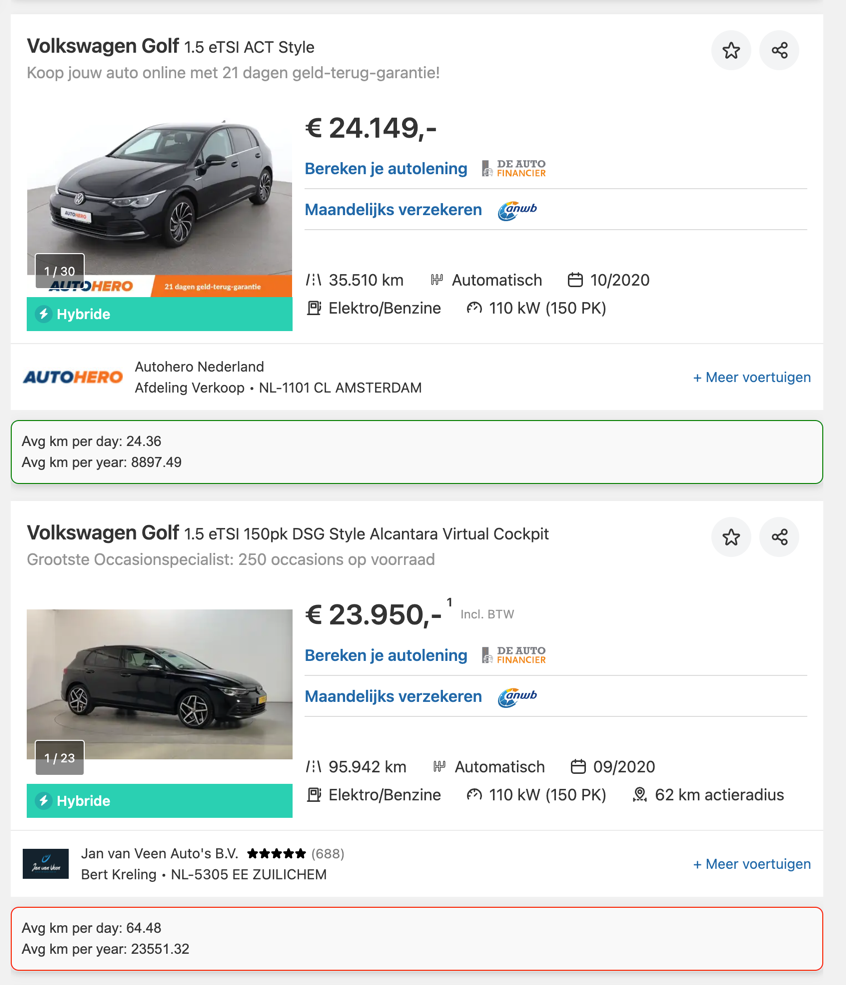

# AutoScout24 Chrome Plugin

This Chrome extension calculates and displays the average kilometers driven per day for vehicles listed on AutoScout24 since their registration date.

## Features
- Automatically calculates the kilometers per day and per year for each vehicle based on the mileage and first registration date.
- Displays the result directly on the vehicle listing page.
- Allows users to set a threshold for kilometers per day and highlights listings that exceed this value via menu

When looking at a car's mileage, it's important to consider that the average mileage for a passenger vehicle depends on the region, driving habits, and other factors. However, on average:

The average mileage per year for a passenger car: is about 15,000 - 20,000 km.
This gives around 40 - 55 km per day.
Things to consider when evaluating mileage:

40-50 km per day — this is a normal mileage for most passenger cars. Such a car was likely used for daily commutes to work and back.
60 km per day or more may indicate that the car was used for long trips or was frequently on the road.
Less than 40 km per day could mean the car was used sparingly, but it's also important to check its overall condition, as underuse can lead to certain components becoming stagnant.
If the car was used regularly but was well-maintained, even slightly higher mileage could be acceptable. It's also important to ensure that the mileage matches the car's age.

So ideally, 40-50 km per day is a reasonable benchmark for a used car's mileage.

